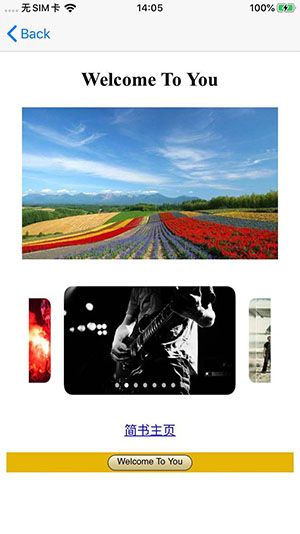

# KJWebDiscernDemo

<p align="left">
  
  
</p>

- 一款长按识别网页当中的图片工具

#### <a id="使用方法"></a>使用方法
```
/// 回调获取长按识别的图片
+ (void)kj_initWithWKWebView:(WKWebView*)webView QRCodeImageBlock:(KJQRCodeImageBlock)block;

```
